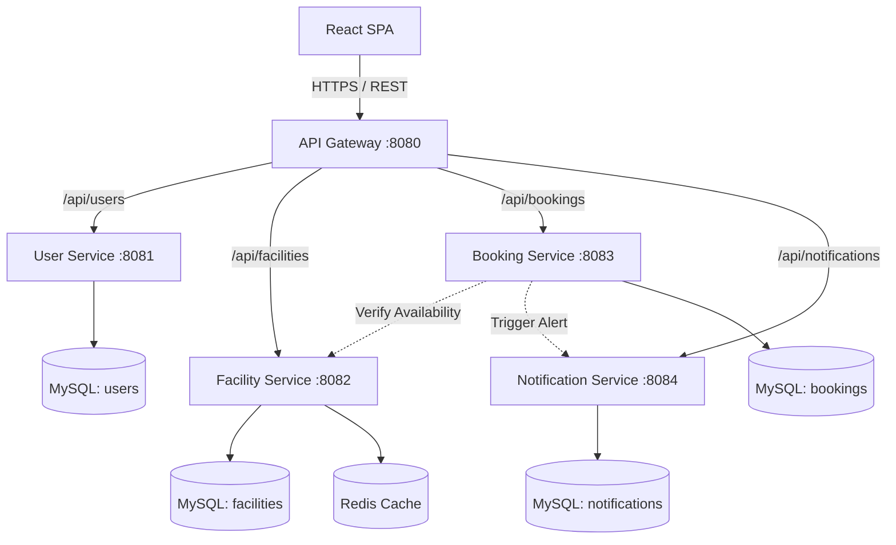

# Campus Services Microservices Platform

## 1. Project Overview
The Campus Services Microservices Platform is a distributed backend and frontend system designed to manage university campus resources. It enables students to browse and book facilities (like seminar halls and study rooms), while giving administrators full control over resource management and booking approvals. 

## 2. Problem Statement
Traditional monolithic campus management systems often suffer from tight coupling, making them difficult to scale, maintain, and upgrade. A failure in one module (e.g., Notifications) can bring down the entire booking process. This project solves these issues by demonstrating a scalable, decoupled, and resilient microservices architecture utilizing modern Java and React paradigms.

## 3. Features
* **Role-Based Access Control (RBAC):** Distinct `STUDENT` and `ADMIN` privileges.
* **Facility Management:** Admin-only CRUD operations for campus resources.
* **Smart Booking System:** Automated validation for time overlaps, availability, and past dates.
* **Real-time Notifications:** Asynchronous alerting for booking status changes.
* **Fault Tolerance:** Circuit breakers and automatic retries prevent cascading network failures.
* **Performance:** Redis caching significantly reduces database load on read-heavy facility queries.

## 4. Architecture Diagram


## 5. Microservices Explanation
* **API Gateway**: The single entry point. Handles CORS, global request logging, and routes traffic to downstream services.
* **User Service**: Manages registration, authentication, and generates JWT tokens.
* **Facility Service**: Manages campus resources. Implements Redis caching for fast retrieval.
* **Booking Service**: The core orchestrator. Verifies facility availability, checks for time overlaps, saves reservations, and triggers notifications.
* **Notification Service**: A dedicated service for tracking user alerts (e.g., "Booking Approved").

## 6. Technology Stack
* **Frontend**: React, Vite, React Router, Axios.
* **Backend**: Java 21, Spring Boot 3.2, Spring Cloud Gateway.
* **Security**: Spring Security, JJWT, BCrypt.
* **Database**: MySQL (Spring Data JPA, Hibernate).
* **Caching**: Redis (Spring Cache).
* **Resilience**: Resilience4j (Circuit Breaker, Retry).
* **Testing**: JUnit 5, Mockito.

## 7. Database Design
Following the **Database-per-Service** pattern, each microservice connects to its own logical database schema (`user_service_db`, `facility_service_db`, etc.). We avoid hard foreign keys across services to maintain loose coupling; for example, the Booking Service stores `facilityId` as a simple `Long`.

## 8. Authentication Flow
1. User submits credentials to `User Service` via the Gateway.
2. Credentials are verified against BCrypt hashes in MySQL.
3. A JWT signed with an HMAC SHA-256 secret is returned.
4. Subsequent requests include the JWT in the `Authorization: Bearer <token>` header.
5. Downstream services use a `JwtAuthenticationFilter` to validate the token and extract the user's ID and role into the Spring Security Context.

## 9. Booking Flow
1. Client POSTs a booking request to the `Booking Service`.
2. `Booking Service` executes a synchronous REST call to `Facility Service` to ensure the facility exists and is available.
3. The database is queried for overlapping `PENDING` or `APPROVED` bookings.
4. If validation passes, the booking is saved within a `@Transactional` block.
5. A synchronous REST call is made to the `Notification Service` to alert the user.

## 10. Redis Caching
The `Facility Service` uses the **Cache-Aside** strategy.
* `GET` requests are served directly from Redis. 
* Admin `POST/PUT/DELETE` requests trigger `@CacheEvict` to clear stale data.
* A custom `CacheErrorHandler` ensures that if Redis goes down, the application gracefully degrades and fetches data directly from MySQL.

## 11. Resilience4j Circuit Breaker
Cross-service communication (Booking → Facility) is protected by Resilience4j.
* **Retry**: Automatically attempts the HTTP call up to 3 times on network failure.
* **Circuit Breaker**: If 50% of calls fail, the circuit opens, failing fast to prevent thread exhaustion.
* **Fallback**: Returns a clean `ServiceUnavailableException` instead of a 500 server crash.

## 12. Testing
The project includes a suite of JUnit 5 and Mockito tests adhering to the **Arrange-Act-Assert (AAA)** pattern. 
* **Service Layer**: Fully isolated unit tests mocking external repositories and clients.
* **Integration**: Spring Boot Tests verifying Resilience4j fallback executions.

## 13. Deployment
The architecture is designed for modern cloud providers:
* **Frontend**: Hosted on Vercel.
* **Backend Services**: Hosted as private background workers on Render.
* **API Gateway**: Hosted as a public web service on Render.
* **Databases**: Managed MySQL (e.g., Aiven) and Managed Redis.

## 14. Screenshots
*(Add screenshots of your deployed application here)*
* 
* 
* 

## 15. API Documentation
See [API_DOCS.md](API_DOCS.md) for detailed endpoint information, request bodies, and authentication requirements.

## 16. Local Setup
1. **Prerequisites**: Java 21, Node.js, Maven, MySQL, Redis.
2. **Databases**: Create 4 MySQL databases: `user_service_db`, `facility_service_db`, `booking_service_db`, `notification_service_db`.
3. **Backend**: 
   ```bash
   cd backend
   mvn clean install -DskipTests
   ```
   Start each service individually (`mvn spring-boot:run`) or use your IDE.
4. **Frontend**:
   ```bash
   cd frontend
   npm install
   npm run dev
   ```

## 17. Environment Variables
You must configure the following environment variables locally or in your CI/CD pipeline:
* `JWT_SECRET`: A secure 256-bit string.
* `DB_URL`, `DB_USERNAME`, `DB_PASSWORD`: MySQL credentials.
* `REDIS_HOST`, `REDIS_PORT`: Redis connection details.
* `[X]_SERVICE_URL`: Pointers for inter-service communication.
* `FRONTEND_URL`: For API Gateway CORS (e.g., `http://localhost:5173`).

## 18. Future Improvements
* **Message Broker**: Replace synchronous REST notifications with asynchronous events using Apache Kafka or RabbitMQ.
* **Service Discovery**: Implement Netflix Eureka for dynamic service routing.
* **Centralized Logging**: Integrate the ELK stack (Elasticsearch, Logstash, Kibana) for distributed tracing.
* **Containerization**: Add Dockerfiles and a `docker-compose.yml` for unified local orchestration.
